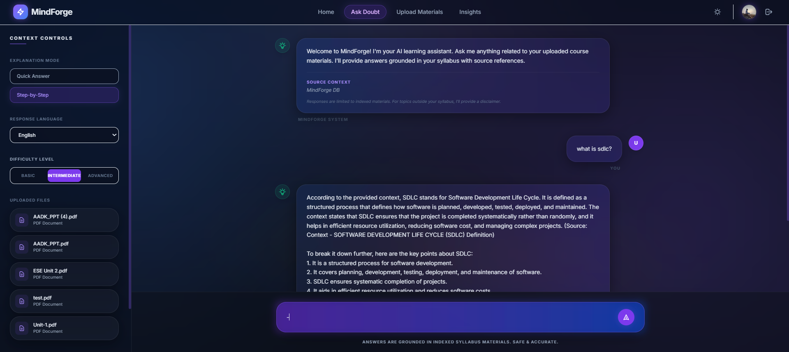

# MindForge 

**MindForge** is an AI-powered learning assistant that provides context-aware doubt resolution. It allows students to upload their syllabus and course materials, then interacts with them using a grounded RAG (Retrieval-Augmented Generation) system to ensure accurate, hallucination-free answers.

## 📸 Chatbot Preview



## 🚀 Key Features

- **Context-Aware Doubt Resolution**: Answers are strictly grounded in your uploaded PDF materials.
- **Multilingual Support**: Interact with the AI in multiple languages (English, Hindi, etc.).
- **Firebase Authentication**: Secure login via Google Sign-In with a modern Glassmorphism UI.
- **Adaptive Explanations**: Choose between "Quick Answer" or "Step-by-Step" modes and adjust difficulty levels.
- **Source Transparency**: Every response cites the specific syllabus document used as context.
- **Speakout Feature**: Built-in Text-to-Speech (TTS) capability allowing users to listen to AI responses for an eyes-free learning experience.
- **No Hallucinations**: Built-in logic to ensure the AI only answers based on provided syllabus materials.

---

## 🛠️ Tech Stack

**Frontend:**

- **React (Vite)**: Modern component-based UI.
- **Tailwind CSS**: Premium Glassmorphism styling and animations.
- **Firebase Auth**: Secure user management.

**Backend:**

- **FastAPI**: High-performance Python backend.
- **Groq API**: State-of-the-art LLM reasoning (Llama 3.3 70B & 3.1 8B).
- **ChromaDB**: Vector database for semester-wide material indexing.
- **Sentence-Transformers**: Semantic embeddings for PDF documents.

---

## 📥 Installation & Setup

Follow these steps to get a local copy of MindForge up and running.

### 📋 Prerequisites

- **Python 3.10+** (for the Backend)
- **Node.js 18+** & **npm** (for the Frontend)
- **Groq API Key** (Get it from [Groq Cloud](https://console.groq.com/))
- **Firebase Project** (Optional, for your own Auth keys)

---

### 🔧 Step 1: Clone the Repository

```bash
git clone https://github.com/SouravLenka/MindForge.git
cd MindForge
```

### 🐍 Step 2: Backend Setup (Python)

The backend handles the RAG logic and PDF processing.

1. **Create and activate a Virtual Environment**:

   ```bash
   # Create venv
   python -m venv venv

   # Activate venv (Windows)
   .\venv\Scripts\activate
   # Activate venv (Mac/Linux)
   source venv/bin/activate
   ```

2. **Install Dependencies**:

   ```bash
   pip install -r requirements.txt
   # Run the server
   python -m uvicorn backend.main:app --reload
   ```

3. **Frontend Setup**:
   ```bash
   cd mindforge-frontend
   npm install
   npm run dev
   ```

---

## 👥 Team Members

- **Sourav Lenka** (23cse115) - _Team Leader_
- **Binita Swain** (23cse071)
- **Biswajit Swain** (23cse168)
- **Shivam Patro** (23cse192)

---

<p align="center">
  Built with by the MindForge Team
</p>
